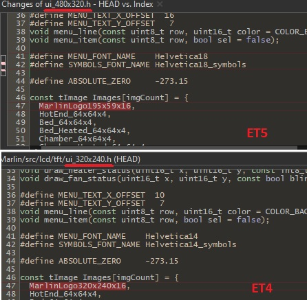

# Change Marlin boot image on ET4

1. Download [Riuson Image Converter](http://www.riuson.com/lcd-image-converter) and open it. 

2. Open the image to be used. Must have a resolution according your display (320x240 for ET4)

3. Go to Options -> Conversion -> Image tab

4. Make sure that the Preset is in Color R5G6B5 and the Block size is 16 bits. 

5. Click OK. 

6. Then File -> Convert

7. Save it and you will have a file with a .c extension

8. Now the important thing here is really to take the hexadecimals and replace those with what is stored in:
\Marlin\src\lcd\tft\images\bootscreen_320x240x16.cpp

## Notes:
- For the ET5 TFT, which has a resolution of 480x320, take this data into account in all the steps where the resolution is required. 
- Take a look at the files related with your resolution logic, like [Marlin/src/lcd/tft/ui_480x320.h](https://github.com/davidtgbe/Marlin/blob/bugfix-2.0.x/Marlin/src/lcd/tft/ui_480x320.h). Sometimes, image paths are hardcoded to show smaller ones in order to free some flash memory, like in this example:

There is also a new define in configuration_adv.h called **BOOT_MARLIN_LOGO_SMALL** which must be commented out:
```
  #if ENABLED(SHOW_BOOTSCREEN)
    #define BOOTSCREEN_TIMEOUT 4000      // (ms) Total Duration to display the boot screen(s)
    #if EITHER(HAS_MARLINUI_U8GLIB, TFT_COLOR_UI)
      //#define BOOT_MARLIN_LOGO_SMALL     // Show a smaller Marlin logo on the Boot Screen (saving lots of flash)
    #endif
  #endif
```
- If image is shown with red and blue colours exchanged, choose the BGR preset instead of the RGB.
- Marlin logic is prone to changes, so, take the basis of this recipe, and you could adapt it to future Marlin changes.